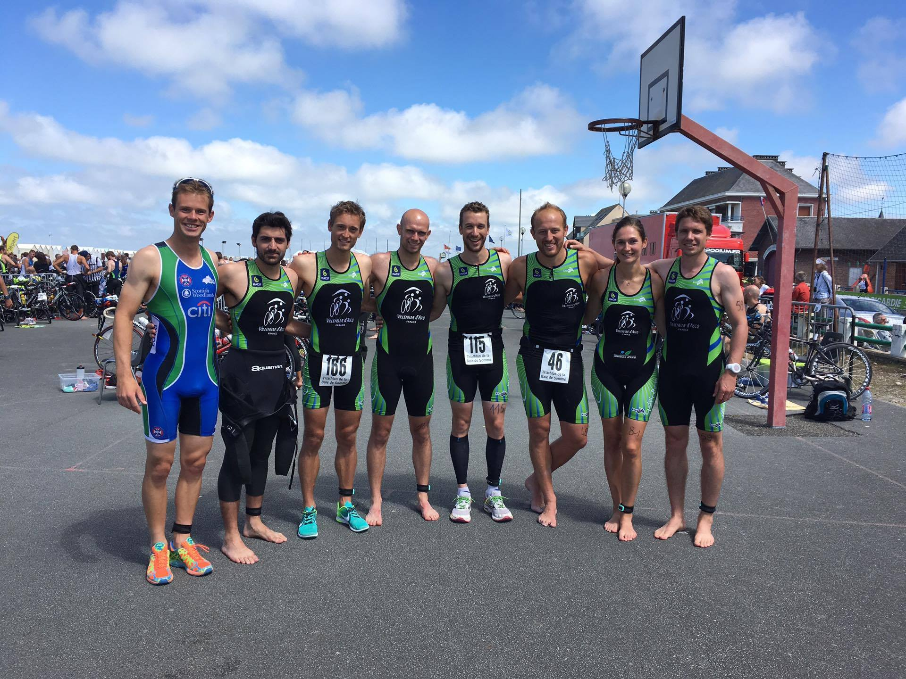

+++
date = "2016-08-06"
title = "Triathlon de Cayeux-sur-mer"
+++

Un EXCELLENT week-end pour les VATri au triathlon de la Baie de Somme à Cayeux sur Mer !!!!

7 membres du club sont allés braver ce triathlon distance M au plateau relevé, en pleine période estivale où les entraînements sont en pause pour certains... Celui-ci s'est très bien terminé en compagnie de Nicolas Gosse, Olivia Peytour et Emmanuel Verfaillie autour d'un bon apéro et d'une excellente mouclade!!!! ;-)

<!--more-->

Les conditions en natation furent très difficiles entre la houle, le courant et la véritable bagarre!!! Une bagarre qui a continué entre les VATri pour la traditionnelle distribution de fessées ! C'est David Doutreligne qui gagne à ce concours en terminant à la 28ème place en 1h17'36. Valentin Druard se classe à la 34ème place en 1h19'28. À la 49 ème place, Romain Hidden met 2h27'04. 73ème, Vincent Belliato fait une très belle course en 2h35'29. Le touriste Vincent Leleu se classe 154ème en 2h49'56 et a eu chaud face à Amandine Veron, 158ème, qui a couru en 2h50'25. Enfin, Vincent Feutry finit son premier triathlon à la 239ème place en 3h08'40. BRAVO À TOUS!!

Merci à Sarah et Adélaïde pour les encouragements et les photos!!!

Et à très bientôt pour la reprise des entraînements!!!!
