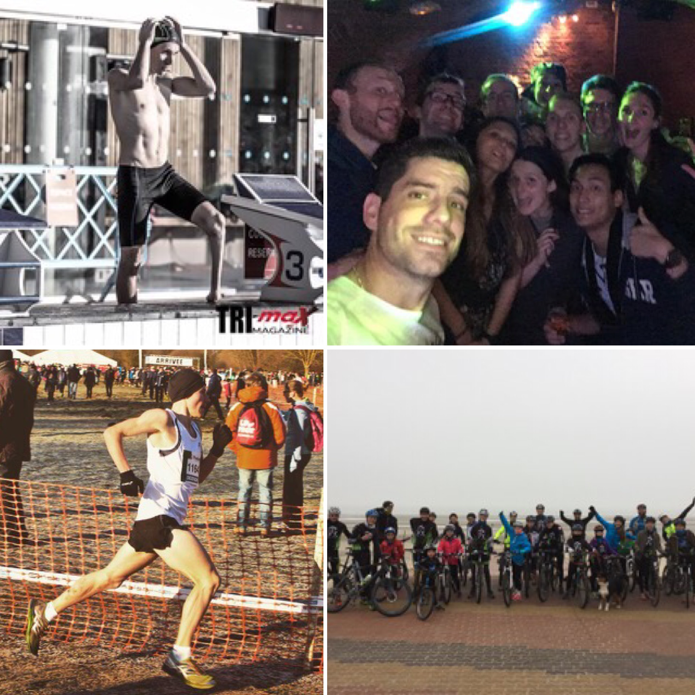

+++
date = "2017-01-01"
title = "Meilleurs voeux pour 2017 !"
+++

Meilleurs v&#339;ux pour 2017 ! De nombreuses réussites sportives !!
Le club de Villeneuve d'Ascq Triathlon vous présente ses meilleurs voeux pour cette année 2017 !! Que de nombreuses réussites sportives comblent votre quotidien !!!

Pensez à inscrire dans vos agendas les dates essentielles de l'année triathlétique, c'est à dire, les 3 manifestations sportives organisées par notre club. RDV dès le 11 mars à la piscine de l'EDHEC pour le 1er aquathlon villeneuvois. Le 23 avril aura lieu le traditionnel triathlon en contre la montre support de la coupe de France. Enfin, le 17 décembre est organisé le 3ème R&B support du championnat du Nord. Pour rappel, toutes nos épreuves ont les labels féminins et triathlon durable !

<!--more-->

## Les actualités de fin d'année

Le dernier mois de l'année 2016 pour le Villeneuve d'Ascq Triathlon a, à nouveau, été très chargé!!

La première soirée de Noël du club a eu lieu et a réuni une soixantaine d'enfants et d'adultes. Un moment très agréable avec comme point d'orgue la distribution des cadeaux !!! Un moment d'échanges, de convivialités et de festivités qui va certainement se reproduire pour les 10 ans du club....

Le samedi 10 décembre, Arthur, jeune membre du club, termine champion de France UGSEL à Lyon! Boris et Jules ont également été très performants dans cette compétition. Nous vous félicitons pour ces très beaux résultats et vous souhaitons encore de belles réussites !!!

Les 16-17-18 décembre ont eu lieu, à Cannes, un stage de détection national en paratriathlon. Pierre-Antoine a eu la chance de pouvoir y participer, se comparer, apprendre et vivre ces moments sportifs avec d'autres paratriathlètes et des membres de la direction technique nationale. Ces trois jours ont été riches d'enseignements et très prometteurs pour notre statut grec apparu sur Trimax ! ;-)

Au tout début des vacances a eu lieu un stage pour l'école de triathlon. Le dimanche, parents et enfants étaient conviés à venir à Bray Dunes. La matinée a été consacrée aux VTT direction La Panne pour un circuit un peu plus technique. L'après-midi, suite à un pic-nic sous la chaleur du nord et sur la plage, s'est improvisé une rencontre de beach soccer et d'ultimate où la bonne ambiance a été de mise ! Pour les plus grands, s'en est suivi un footing dans les dunes alors que les plus petits s'y sont baladés avec des séquences de jeux et de combats ! Les lundi et mardi, différents jeux d'endurance, de vitesse ou de technique VTT, enchaînements et CAP ont été proposés sous divers formats au niveau du lac du héron. Bravo à la vingtaine de jeunots présents pour leur investissement et leur joie d'apprendre !!!

Ce fût un très bon mois de décembre où nous n'oublions pas les compétitions auxquelles les VATri ont participé à l'instar du R&B de Valenciennes, du cross du VAFA ...

Pensez à liker notre page sur Facebook afin de connaître toutes les actualités du club!