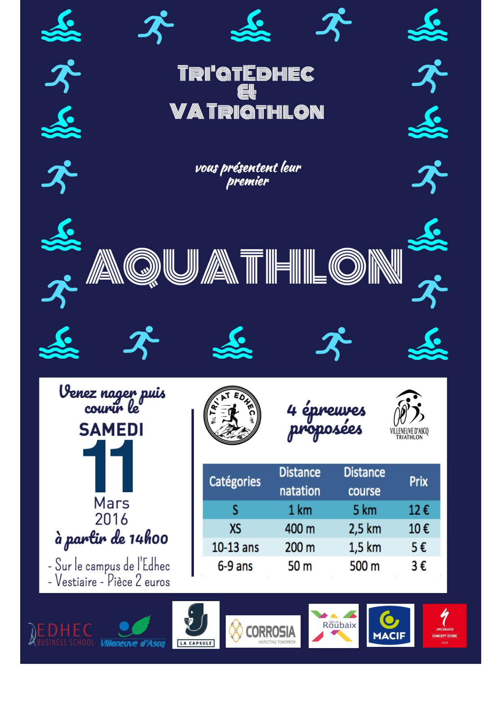

+++
date = "2017-01-25"
title = "Aquathlon du Club - 11 Mars 2017"
+++

Le 11 mars 2017 est organisé, en partenariat avec l'EDHEC, le premier aquathlon du club.

Quatre courses sont prévues dans l'organisation : 

- Course S (1km/5kms) dès 14h avec 3 vagues. 
- Course XS (400m/2,5kms) dès 16h avec 3 vagues. 
- Course 10-13 ans (100m/1,250km) à 17h. 
- Course 6-9 ans (50m/100m) à 17h30. 

<!--more-->

Des équipes en relais peuvent également s'inscrire.
Cette compétition aura lieu sur le site de l'EDHEC, Rue Verte à Croix. 

N'hésitez pas nous contacter pour de plus amples informations. 

Voici le lien d'inscription : http://inscriptions-teve.fr/aquathlon-de-villeneuve-d-ascq-2017/select_competition

Au plaisir de vous voir !!!
