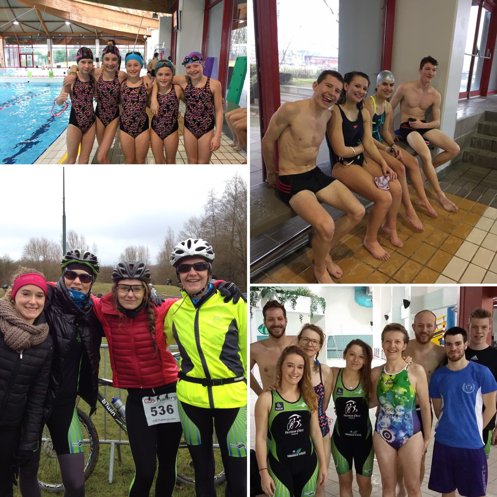

+++
date = "2017-02-01"
title = "Un début d'année au taquet"
+++

L'actualité du mois de janvier montre un début d'année prudent de la part des VATri ... Ces derniers ont été nombreux à se présenter au R&B d'Hazebrouck, aux cross triathlons d'Avion et de Liévin. C'est cette dernière compétition qui a attiré le plus de VATri pour son parcours VTT exigeant et sa célèbre montée de terril en CAP ! Notons les belles performances d'Adam (5ème minime au XS), d'Adrien (1er junior), Nathalie la maman d'Adrien (2ème vétérane), de Kevin (5ème sénior) et de Noémie (5ème senior) sur un plateau relevé avec la présence du champion de France en titre Brice Daubord!

Un autre événement très important a eu lieu ce mois-ci avec l'organisation du class triathlon. L'enjeu est que les jeunes triathlètes passent une épreuve de natation et une épreuve de CAP. Le club a organisé ce class tri et a accueilli d'autres clubs de la région Lilloise. Une cinquantaine de jeunes se sont prêtés au jeu et nous félicitons nos mini-VATri qui ont montré leurs talents et leurs progrès au cours de cette après-midi pluvieuse... Merci également aux partenaires qui nous ont aidé pour cette organisation.

N'oubliez pas l'aquathlon de Villeneuve et de l'EDHEC organisé le 11 mars. Les places partent donc pensez à vite vous inscrire! 
Le lien -> http://inscriptions-teve.fr/aquathlon-de-villeneuve-d-ascq-2017/select_competition

À très bientôt pour un mois de février qui va tout doucement monter en puissance...
